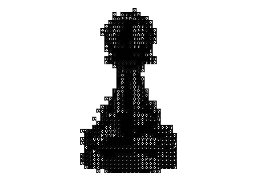
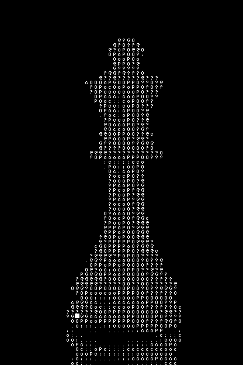

# Go ASCII Art Converter

Um utilitário de linha de comando escrito em **Go (Golang)** que transforma imagens PNG convencionais em composições baseadas em caracteres ASCII, gerando uma nova imagem como resultado.

Este projeto foi desenvolvido para aprofundar conhecimentos em processamento digital de imagens, manipulação de arquivos e uso eficiente da biblioteca padrão da linguagem.

## Demonstração

| Antes (Imagem Original) | Depois (Resultado em ASCII) |
| :---: | :---: |
|  |  |
|  |  |

## Competências técnicas

  * **Manipulação de Arquivos e I/O:** Leitura e gravação segura de arquivos binários (imagens PNG) usando o pacote `os`.
  * **Processamento de Imagens Nativo:** Uso extensivo da biblioteca `image` do Go (sem dependências externas de terceiros) para decodificação, criação de *bounding boxes* e desenho (`image/draw`).
  * **Algoritmos e Lógica Matemática:**
      * **Escala de Cinza:** Conversão de pixels coloridos para luminosidade (Grayscale).
      * **Downscaling (Nearest Neighbour):** Implementação manual do algoritmo do vizinho mais próximo para redimensionamento de imagens.
      * **Quantização de Cores:** Mapeamento de intensidades de pixel para corresponder dinamicamente a uma paleta limitada de caracteres (blocos ASCII).
  * **Boas Práticas:** Código modularizado em funções de responsabilidade única e tratamento de erros (safeguards para limites de *arrays*).

## Como executar

1.  Certifique-se de ter o [Go instalado](https://go.dev/doc/install) na sua máquina.
2.  Clone este repositório.
3.  Coloque a imagem que deseja converter (no formato `.png`) na pasta `images/`.
4.  Execute o programa:

<!-- end list -->

```bash
go run main.go
```

5.  Digite o nome da imagem (sem a extensão) quando o terminal solicitar.
6.  O resultado será salvo na pasta `images/` com o sufixo `_ASCII`.
